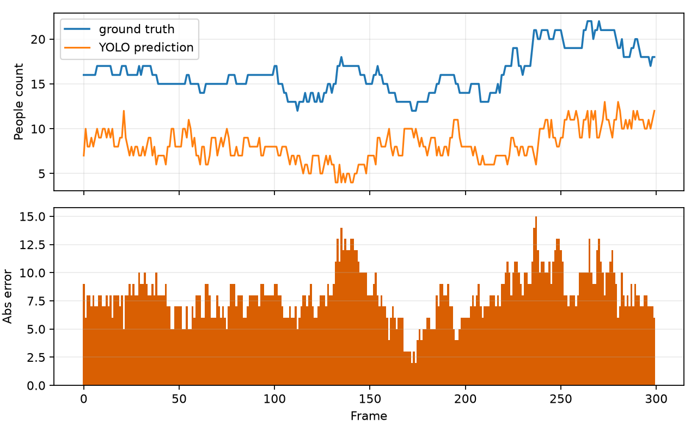
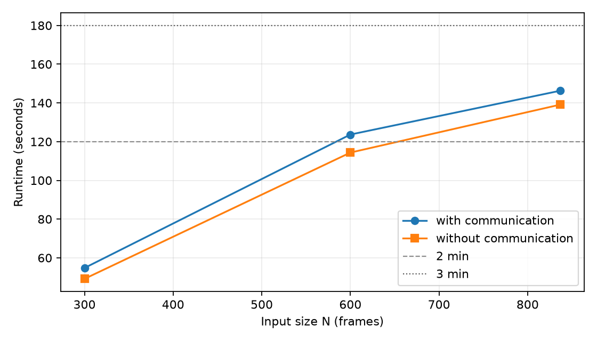
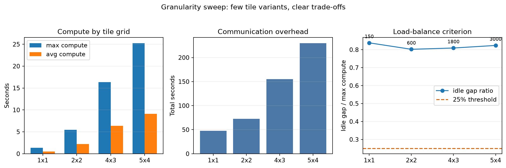
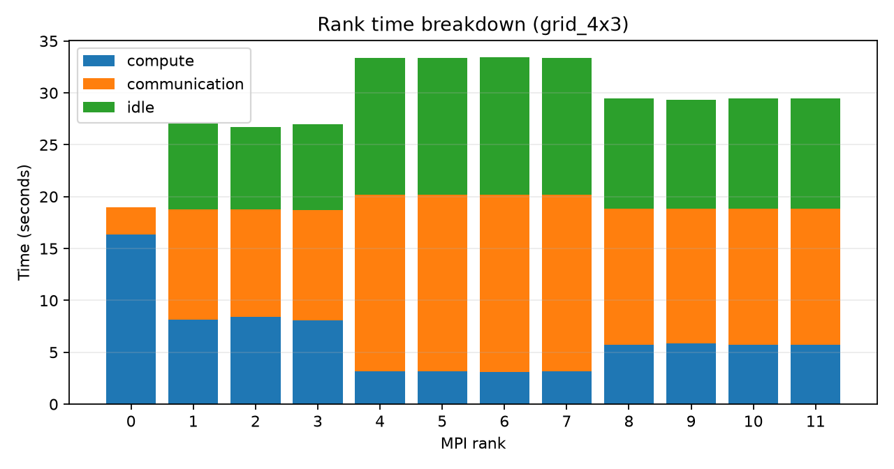
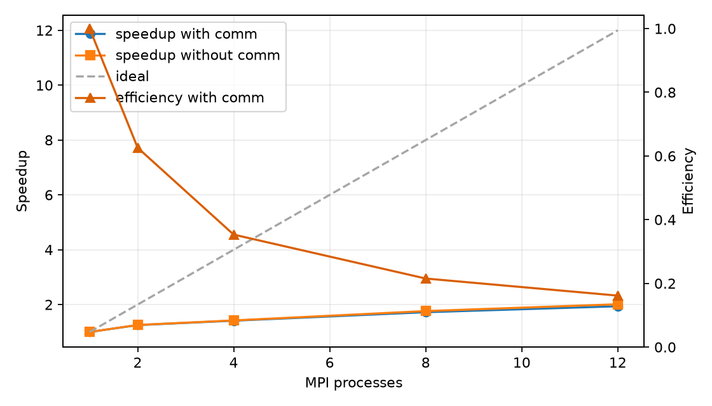
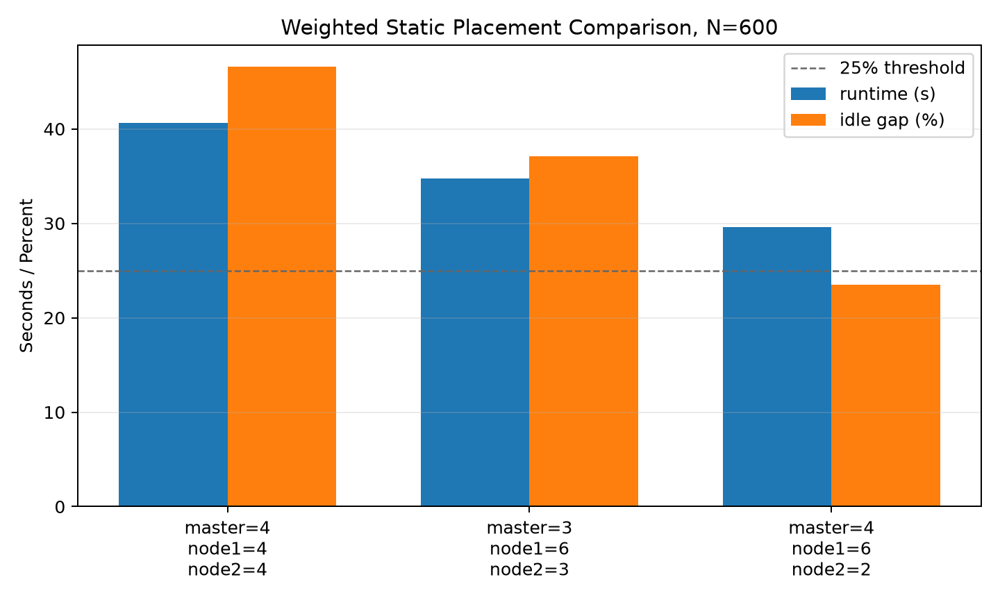
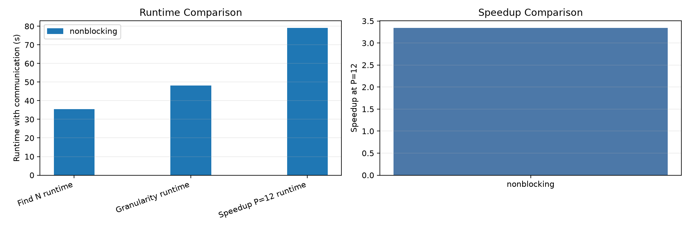

# HANOI UNIVERSITY OF SCIENCE AND TECHNOLOGY

### SCHOOL OF INFORMATION AND COMMUNICATIONS TECHNOLOGY

## COURSE PROJECT REPORT

**Course:** Parallel Programming and Computing
**Project title:** Parallel Video-Based People Counting with YOLO and OpenMPI on a Three-Machine Cluster
**Group:** <ID nhóm>
**Students:** Phạm Chí Bằng - 2035477; Nguyễn Thanh Lâm - 20235519; Nguyễn Phú An - 20235466; Lưu Hiếu An - 202400093
**Submission date:** 24 June 2026

**Hanoi, 2026**

---

## Abstract

This project studies the parallelization of video-based people counting on a small physical cluster. A pretrained YOLO detector is used as the computationally intensive component, while the main contribution of the project is the design, implementation, and evaluation of a parallel inference pipeline using C++17 and OpenMPI. The system runs on three MacBook machines connected through a local area network. The benchmark mode uses CPU execution to align with the process-oriented requirements of the course, while a live-camera mode is kept as an application demonstration.

The video stream is decomposed along both time and image space. Frames provide independent temporal work units, and each frame may be divided into image regions to increase task granularity. These tasks are then mapped to MPI processes using static block-cyclic scheduling. The master process gathers detector outputs, remaps bounding boxes to the original frame, removes duplicates across region boundaries, and produces frame-level people counts. This design exposes the main issues of parallel programming: decomposition, mapping, communication, load balancing, granularity, and speedup.

Experiments were conducted on MOT17-derived video data. The parallel implementation was first validated against a serial baseline, producing identical frame counts in the correctness test. The detector output was also compared against MOT17 ground truth counts to separate model accuracy from parallel correctness. A long-sequence benchmark identified a 600-frame workload whose wall-clock runtime was 123.667 seconds on twelve processes, satisfying the required two-to-three-minute input-size criterion. For a 1200-frame workload, the system achieved a wall-clock speedup of 1.939x at twelve processes. Additional experiments investigated granularity, weighted process placement, and non-blocking communication. The best weighted placement reduced the idle-gap indicator from 0.466 to 0.235, satisfying the twenty-five percent load-balance criterion. The final non-blocking static gather experiment with the same four-six-two placement achieved 3.342x wall-clock speedup on the 1200-frame workload.

**Keywords:** parallel computing, OpenMPI, object detection, YOLO, people counting, load balancing, speedup, distributed video processing.

## Table of Contents

1. Introduction
2. Problem Statement and Background
3. Parallelization Methodology
4. Parallel Algorithm Design
5. Experimental Environment
6. Experimental Methodology
7. Results and Discussion
8. Compliance with Assignment Requirements
9. Limitations and Future Work
10. Conclusion
11. References

## List of Figures

1. Counting error over frames
2. Runtime as input size increases
3. Granularity overview
4. Per-process timing for the four-by-three configuration
5. Speedup on the twelve-hundred-frame workload
6. Weighted static placement comparison
7. Non-blocking communication overview

## List of Tables

1. Physical cluster roles
2. Main experimental configuration
3. Parallel correctness
4. Detector accuracy against ground truth
5. Compact input-size trend
6. Long-sequence input-size trend
7. Granularity and load balance
8. Speedup evaluation
9. Weighted static placement
10. Non-blocking communication
11. Per-host behavior under weighted placement
12. Assignment requirement mapping

## 1. Introduction

People counting in video is a practical problem in classroom monitoring, public-space analysis, pedestrian flow estimation, and crowd management. Modern object detectors can identify people in individual frames, but applying a detector to a long video can be computationally expensive. Since many frames and image regions can be processed independently, the problem is a suitable case study for parallel programming on a distributed-memory cluster.

The aim of this project is not to train a new deep learning model. Instead, a pretrained YOLO detector is used to create a realistic and sufficiently heavy workload. The focus is the parallelization of the inference pipeline: how a video is decomposed, how tasks are assigned to processes, how intermediate detections are communicated, how duplicate boxes are removed, and how performance changes as the number of processes and task granularity vary.

The project also addresses an important distinction in applied parallel computing. A detector may produce inaccurate counts because of occlusion, small objects, lighting, or model limitations. This is a model accuracy issue. Separately, a parallel implementation may be incorrect if it changes the result compared with a serial implementation. This is a parallel correctness issue. The report therefore evaluates both aspects: serial-versus-parallel agreement and detector-versus-ground-truth accuracy.

The course assignment requires a physical MPI cluster of at least three machines, a meaningful parallel algorithm, a clear explanation of decomposition and communication, correctness verification, an input-size study, a granularity and load-balance study, and speedup measurements. This report follows that structure and presents experimental evidence for each requirement.

## 2. Problem Statement and Background

The problem is to estimate the number of people appearing in each frame of a video. The input is a video sequence and a pretrained object detector. The output is a sequence of predicted people counts, together with the detection boxes used to compute these counts. The computationally expensive operation is detector inference over many images or image regions.

YOLO is a one-stage object detection family. For each image, it predicts a set of bounding boxes, class labels, and confidence scores. In this project, only detections corresponding to the person class are retained. YOLO is not the subject of parallelization at the neural-network-kernel level; instead, the detector is treated as a local computational routine invoked by each MPI process. OpenMPI is responsible for distributing independent video tasks across processes.

MOT17 is used as the main dataset source because it is a common benchmark for pedestrian video analysis. It contains crowded scenes, occlusions, and people at multiple scales. These characteristics make it more challenging than a simple self-recorded video and more appropriate for evaluating a people-counting pipeline. A compact MOT17 subset is used for rapid correctness and granularity experiments, while longer sequences are used to find the required workload size and evaluate speedup.

The primary benchmark is CPU-based. This decision is intentional. The course requirement emphasizes MPI processes and processor assignment, so the main experiments must reflect process-level parallelism. Apple GPU and MPS execution are useful for a live demonstration, but they introduce GPU contention when multiple processes share the same device. Therefore, GPU execution is treated as an application demonstration rather than the official benchmark mode.

## 3. Parallelization Methodology

### 3.1 Level of Parallelism

The project uses task-level parallelism. Each unit of work corresponds to detector inference over one image region from one video frame. These units can be computed independently before their results are merged. Task-level parallelism is appropriate here because video processing naturally produces many independent pieces of work, and the runtime of each piece can vary depending on image content.

This differs from data-parallel training of neural networks. The project does not split a single neural-network operation across many processes. Instead, it distributes many independent detector calls across a cluster. MPI controls the process-level scheduling, while YOLO runs locally inside each assigned task.

### 3.2 Decomposition Technique

The decomposition is hybrid temporal-spatial decomposition. Temporal decomposition divides the video into frames. Spatial decomposition divides each frame into regions. A task is defined conceptually as one region from one frame. This hybrid design creates more work units than frame-only decomposition and therefore gives the scheduler more opportunities to keep all processes busy.

Frame-only decomposition is simpler, but it has weaknesses. If the video is short, the number of frames may not be enough to feed many processes. In addition, frames are not equally difficult: crowded frames and frames with severe occlusion may take longer to process. Spatial decomposition makes tasks finer, which can improve load balance, but it also increases communication and requires stronger post-processing to remove duplicated detections near region boundaries.

Thus, the decomposition is a trade-off. Coarse tasks reduce communication but may leave processes idle. Fine tasks improve scheduling flexibility but increase the amount of intermediate output and the cost of merging detections. The granularity experiment in this report measures this trade-off directly.

### 3.3 Mapping Technique

The two-dimensional structure of video frames and image regions is mapped into a one-dimensional list of independent tasks. This one-dimensional flattened mapping simplifies process assignment. The final implementation uses static block-cyclic scheduling.

In static scheduling, tasks are assigned in a deterministic block-cyclic manner before execution. This approach has low scheduling overhead and little communication during computation. However, it assumes that tasks have similar costs. If some processes receive harder regions or slower frames, the entire program must wait for them.

The project also includes a weighted process placement experiment. Since the machines are not identical, a stronger machine can be assigned more processes than a weaker one. This is not a replacement for the standard speedup experiment; it is an additional study showing how mapping can be adapted to a heterogeneous physical cluster.

### 3.4 Communication Strategy and Topology

The communication topology is a master-worker star topology. All processes derive the same ordered task list, so the master does not need to send every offline task at runtime. Each process independently selects its static subset, performs local detection, and sends detection results and timing metrics back to the master for final merging.

The original communication strategy uses blocking communication for the main send and receive operations. The optimized static variant also includes a non-blocking result-gather stage. In that version, worker ranks send payload sizes and serialized detection results using non-blocking sends, while the master posts non-blocking receives and waits for all results together. The gathered information includes both detection boxes and per-process timing data. The amount of data communicated is kept moderate because the video files and model files are synchronized to each machine before benchmarking. Therefore, the cluster mostly exchanges task metadata and detection results rather than raw video frames.

The master-worker design is suitable for this problem because duplicate removal and final counting require a global view of all detections from the same frame. If each process counted independently, a person crossing a region boundary could be counted more than once. Centralized merging at the master avoids this inconsistency.

### 3.5 Load Balancing Considerations

Load balancing is addressed at two levels. First, the project evaluates different region grids to control task granularity. Second, weighted mapping is tested to account for the different computational capacities of the machines.

The ideal system would keep all processes computing for most of the runtime. In practice, idle time can appear because tasks are uneven, the network is not free, the machines are heterogeneous, and the master must perform result merging. The report therefore measures computation time, communication time, and idle time for each process. This per-process view is more informative than a single total runtime.

## 4. Parallel Algorithm Design

### 4.1 Overall Pipeline

The pipeline begins with video frame extraction. Each frame is optionally divided into several image regions. The scheduler assigns these regions to MPI processes. Each process runs YOLO locally on its assigned regions and returns the detected people boxes. The master then converts region-local detections into frame-level detections, removes duplicates, and computes the people count for each frame.

The serial baseline follows the same logical pipeline with a single process. This is important because the baseline and the parallel program use the same detector configuration and the same post-processing logic. A difference between the serial and parallel results would therefore indicate an error in task partitioning, communication, or merging rather than a difference in model behavior.

### 4.2 Static Scheduling

In static scheduling, all tasks are assigned before execution. Each process independently selects the tasks assigned to it and runs the detector. After finishing local work, the processes send their results to the master. The master combines all results, removes duplicated detections, and writes the final counts.

The main advantage of static scheduling is simplicity. It has lower coordination overhead because the master does not need to repeatedly dispatch work during execution. The main disadvantage is sensitivity to imbalance. If one process receives more expensive tasks, all other processes must wait at the end.

### 4.3 Parallel Algorithm Pseudo-code

The following pseudo-code is written at the algorithmic level rather than as source code. It summarizes the final static scheduling algorithm used in the project.

**Algorithm 1. Static parallel people-counting pipeline**

1. The master prepares the video workload by dividing the input sequence into frames and image regions.
2. All processes derive the same ordered task list from the workload description.
3. Each process selects the subset of tasks assigned to it by the static mapping rule.
4. Each process performs local detector inference on its assigned tasks and stores the resulting people detections.
5. All worker processes send their local detections and timing measurements to the master.
6. The master converts all detections to full-frame coordinates.
7. The master removes duplicated detections across neighboring regions.
8. The master computes the people count for each frame and writes the final experimental metrics.

The static algorithm intentionally avoids repeated task-dispatch traffic. This makes the implementation easier to explain, easier to reproduce, and better suited to the final weighted-placement and non-blocking communication experiments.

### 4.4 Bounding-Box Merging and Duplicate Removal

Spatial decomposition creates a post-processing challenge. A person near the boundary between two regions may be detected in both regions. Without global filtering, the same person could be counted multiple times. The master therefore performs a sequence of merging operations.

First, detections produced in region coordinates are transformed back into full-frame coordinates. Second, a region ownership rule keeps detections whose centers belong to the reliable core of the region. Third, global non-maximum suppression removes highly overlapping boxes across all regions of the same frame. Finally, additional duplicate handling reduces repeated detections for very large people close to the camera.

This post-processing stage is essential for correctness. The decomposition increases parallelism, but the final answer must still correspond to people in the original frame, not people separately counted in each region.

### 4.5 Timing Metrics

Each process records timing information in three categories: computation, communication, and idle or waiting time. Computation time represents local detector execution and local task processing. Communication time represents the exchange of task assignments, detections, and metrics. Idle time represents waiting caused by imbalance or synchronization.

The report distinguishes wall-clock runtime from computation-only runtime. Wall-clock runtime reflects the actual time experienced by the user and includes communication, coordination, and waiting. Computation-only runtime helps show how much time is spent on useful detector work. The gap between these two measurements indicates the cost of the distributed execution framework.

## 5. Experimental Environment

### 5.1 Physical Cluster

The experiments were run on three physical MacBook machines connected through the same local area network. Remote login was enabled on all machines, and OpenMPI was installed on each node. The cluster roles are shown in Table 1.

| Role | Responsibility |
|---|---|
| Master | Coordinates execution, gathers results, stores outputs, and runs the live-camera display |
| Worker 1 | Executes detector tasks and participates in benchmark runs |
| Worker 2 | Executes detector tasks and participates in benchmark runs |

The benchmark mode uses CPU execution. This makes the number of MPI processes meaningful for the course requirements. The live-camera mode may use Apple GPU acceleration for demonstration, but it is not mixed into the official CPU benchmark results.

### 5.2 Data and Model

The detector is a pretrained lightweight YOLO model. The main data source is MOT17. A compact MOT17 subset is used for quick correctness and granularity measurements. Longer MOT17-derived sequences are used for the input-size study and speedup measurement.

The ground truth annotations are converted into frame-level people counts. These counts are used only for the detector accuracy evaluation. They are not used for training. The project is therefore an inference and parallel-processing project, not a supervised training project.

### 5.3 Main Experimental Configuration

Table 2 summarizes the main configuration used for the reported CPU experiments.

| Item | Setting |
|---|---|
| Detector | Pretrained YOLO |
| Benchmark device | CPU |
| Main scheduler | Static block-cyclic scheduling |
| Main process count | Twelve processes |
| Main region grid | Four by three regions |
| Long-run region grid | Five by four regions |
| Dataset source | MOT17-derived sequences |
| Parallel framework | C++17 and OpenMPI |

### 5.4 Code Volume

The implementation includes C++17 source code, Python helper utilities, plotting scripts, cluster scripts, and report-generation tools. The selected project files contain more than six thousand lines, exceeding the minimum code-size requirement for a four-member group. The report does not rely on line count as the main contribution; the main contribution is the parallel algorithm and its experimental evaluation.

## 6. Experimental Methodology

### 6.1 Parallel Correctness

The first experiment checks whether the parallel implementation preserves the serial result. The same video, detector, thresholds, and post-processing settings are used for both runs. The predicted count of each frame is compared between the serial baseline and the MPI implementation. A passing result means that the parallel decomposition, communication, and merging do not alter the answer produced by the pipeline.

### 6.2 Detector Accuracy Against Ground Truth

The second experiment compares the predicted frame counts against MOT17 ground truth counts. This measures detector accuracy rather than parallel correctness. The project reports mean absolute error, root mean squared error, percentage error, and exact-match ratio. These values are useful for understanding the application quality, but they should not be confused with correctness of the MPI implementation.

### 6.3 Input-Size Selection

The assignment requires an input size whose runtime is approximately two to three minutes when using a number of processes equal to the total number of physical cores selected for the cluster benchmark. The project measures several video lengths and reports runtime with and without communication. A 600-frame long-sequence workload is selected because its wall-clock runtime is 123.667 seconds with twelve processes.

### 6.4 Granularity and Load Balance

The granularity experiment varies the number of image regions per frame. The tested configurations range from a full-frame task to finer spatial divisions. For each configuration, the report records task count, maximum computation time, average computation time, total communication time, total idle time, and an idle-gap indicator. A stacked per-process chart is used to visualize computation, communication, and idle time.

The assignment specifies that if the idle time between any two processes differs by more than twenty-five percent, the system should be considered insufficiently balanced. The report explicitly applies this criterion. Initial equal placement does not satisfy the criterion, so a weighted static placement is also tested on the heterogeneous cluster.

### 6.5 Speedup Evaluation

After selecting the required input size, the speedup experiment uses a workload twice as large. The process count is varied across one, two, four, eight, and twelve processes. Wall-clock speedup is computed from the ratio between the one-process runtime and the multi-process runtime. A separate computation-only trend is also shown to separate useful work from communication and coordination costs.

### 6.6 Weighted Mapping on a Heterogeneous Cluster

The cluster machines are not identical. A weighted mapping experiment assigns more processes to the stronger machine and fewer processes to the weaker one. This experiment is not the main course benchmark, but it provides additional insight into processor assignment on heterogeneous physical machines.

### 6.7 Non-Blocking Communication

After the static weighted placement is selected, the final result-gather stage is also tested with non-blocking MPI communication. This experiment keeps the same task decomposition, detector, and four-six-two process placement, but replaces the blocking static gather with `MPI_Isend`, `MPI_Irecv`, and `MPI_Waitall`. The goal is to evaluate whether a non-blocking communication style can reduce result-collection overhead while preserving the same serial-versus-MPI output.

## 7. Results and Discussion

### 7.1 Parallel Correctness

Table 3 shows the serial-versus-parallel correctness result. The MPI run produced the same frame counts as the serial baseline in the tested sequence.

| Result | Frames compared | Mismatched frames | Maximum count error | Mean count error |
|---|---:|---:|---:|---:|
| Passed | 30 | 0 | 0 | 0.000 |

This result validates the parallel pipeline for the tested configuration. The frame-level agreement indicates that task splitting, result communication, coordinate remapping, and duplicate removal are consistent with the serial baseline.

### 7.2 Detector Accuracy

Table 4 compares predicted counts against MOT17 ground truth counts. The detector undercounts in crowded scenes, which is expected because the model is pretrained and not specialized for the MOT17 crowd setting.

| Frames | Mean absolute error | Root mean squared error | Percentage error | Exact-match ratio | Ground-truth average | Predicted average |
|---:|---:|---:|---:|---:|---:|---:|
| 300 | 7.983 | 8.269 | 0.490 | 0.000 | 16.207 | 8.223 |

The accuracy result should be interpreted separately from the parallel correctness result. The model may undercount people because of occlusion, small pedestrians, and crowded scenes, but the MPI implementation can still be correct if it reproduces the serial pipeline output.

### 7.3 Input-Size Study

The compact MOT17 subset is useful for quick tests but is too short to reach the required two-to-three-minute runtime. Table 5 reports the compact-sequence trend.

| Frames | Runtime with communication (s) | Runtime without communication (s) | Processes | Region grid |
|---:|---:|---:|---:|---|
| 30 | 9.165 | 2.999 | 12 | Four by three |
| 60 | 12.570 | 6.801 | 12 | Four by three |
| 100 | 17.776 | 11.596 | 12 | Four by three |
| 150 | 23.585 | 17.103 | 12 | Four by three |

The long-sequence experiment uses a finer region grid and longer video segments. Table 6 shows the result.

| Frames | Runtime with communication (s) | Runtime without communication (s) | Processes | Region grid |
|---:|---:|---:|---:|---|
| 300 | 54.764 | 49.156 | 12 | Five by four |
| 600 | 123.667 | 114.352 | 12 | Five by four |
| 837 | 146.316 | 139.136 | 12 | Five by four |

The selected input size is six hundred frames. Its wall-clock runtime is 123.667 seconds, which lies within the required two-to-three-minute interval. The difference between the two runtime curves represents the cost of communication, coordination, and waiting.

### 7.4 Granularity and Load Balance

Table 7 summarizes the granularity experiment. The compact dataset does not achieve the desired idle-balance criterion, but the result is useful because it reveals how task size affects computation, communication, and waiting.

| Region grid | Processes | Tasks | Maximum computation (s) | Average computation (s) | Total communication (s) | Total idle (s) | Idle-gap indicator | Balance result |
|---|---:|---:|---:|---:|---:|---:|---:|---|
| One by one | 12 | 150 | 1.367 | 0.483 | 47.417 | 10.615 | 0.838 | Not balanced |
| Two by two | 12 | 600 | 5.447 | 2.205 | 72.434 | 38.902 | 0.802 | Not balanced |
| Four by three | 12 | 1800 | 16.329 | 6.375 | 154.944 | 119.449 | 0.809 | Not balanced |
| Five by four | 12 | 3000 | 25.263 | 9.133 | 230.059 | 193.569 | 0.824 | Not balanced |

The full-frame setting is too coarse to expose much spatial parallelism. Finer regions create more tasks, which gives the scheduler more opportunities to distribute work. However, finer regions also create more intermediate detections and more communication. The four-by-three setting is a reasonable demonstration configuration, while the five-by-four setting is more suitable for the longer input-size and speedup experiments.

The balance result is not ideal. Rather than hiding this, the experiment makes the limitation visible. The likely causes are heterogeneous machines, short compact input, detector-worker overhead, and master-side merging. This is a realistic outcome in distributed-memory video processing and motivates the weighted-mapping experiment.

### 7.5 Speedup on a Workload Twice as Large

After selecting the six-hundred-frame workload, the speedup experiment uses a twelve-hundred-frame input. Table 8 shows the runtime and speedup trend.

| Processes | Runtime with communication (s) | Runtime without communication (s) | Wall-clock speedup | Efficiency |
|---:|---:|---:|---:|---:|
| 1 | 345.677 | 342.467 | 1.000 | 1.000 |
| 2 | 276.155 | 272.546 | 1.252 | 0.626 |
| 4 | 244.747 | 240.905 | 1.412 | 0.353 |
| 8 | 200.770 | 194.282 | 1.722 | 0.215 |
| 12 | 178.306 | 170.255 | 1.939 | 0.162 |

Speedup improves as the number of processes increases, but it is not linear. At twelve processes, the wall-clock speedup is 1.939x. The computation-only speedup is approximately 2.011x. The gap between these values is caused by communication, scheduling, result collection, duplicate removal, and contention for CPU resources on each machine.

This result is reasonable for a real cluster running a mixed workload. Pure numerical kernels often scale better because they have less irregular post-processing and smaller coordination overhead. In contrast, this project combines detector inference, video processing, distributed communication, and global merging.

### 7.6 Weighted Mapping on Heterogeneous Machines

Table 9 shows the weighted static placement experiment on the 600-frame workload. The cluster is heterogeneous: the master is a MacBook Air M4, node1 is a MacBook Pro M4, and node2 is a MacBook Air M2. Equal placement assigns four ranks to each machine. Weighted placement assigns more ranks to the stronger machine and fewer ranks to the weaker machine.

| Placement | Process distribution | Runtime with communication (s) | Runtime without communication (s) | Idle-gap indicator | Balance result |
|---|---|---:|---:|---:|---|
| Uniform placement | Master 4, node1 4, node2 4 | 40.619 | 36.522 | 0.466 | Not balanced |
| Weighted placement | Master 3, node1 6, node2 3 | 34.712 | 30.339 | 0.371 | Not balanced |
| Weighted placement | Master 4, node1 6, node2 2 | 29.581 | 27.484 | 0.235 | Balanced |

Table 10 summarizes the per-host behavior of the best placement.

| Host | Machine type | Assigned ranks | Approximate per-rank compute time |
|---|---|---:|---:|
| Master | MacBook Air M4 | 4 | 24.8-25.1 s |
| node1 | MacBook Pro M4 | 6 | 26.8-27.5 s |
| node2 | MacBook Air M2 | 2 | 21.0-21.3 s |

The final four-six-two placement reduces runtime and satisfies the twenty-five percent load-balance criterion. The experiment shows why equal process placement is not appropriate on a heterogeneous physical cluster. Equal placement gives every machine the same number of ranks, but the machines do not have the same performance. Weighted placement uses measured behavior to assign more work to the stronger node and less work to the weaker node.

### 7.7 Non-Blocking Communication Experiment

Table 11 shows the optimized static non-blocking experiment with the four-six-two placement. The correctness test still passes, so the communication change does not alter the final frame counts.

| Metric | Value |
|---|---:|
| Correctness pass | YES |
| Accuracy MAE | 8.347 |
| Runtime for 600 frames | 35.452 s |
| Runtime for 600 frames without communication | 33.181 s |
| Runtime for 1200 frames at P=12 | 79.059 s |
| Speedup at P=12 | 3.342 |
| Efficiency at P=12 | 0.278 |

The non-blocking variant should be interpreted as a communication optimization of the static pipeline. It does not split YOLO inference internally and it does not fully overlap detector computation with communication. Each rank still finishes its assigned tile tasks first. The improvement comes from collecting variable-length serialized results with non-blocking operations at the final aggregation stage.

### 7.8 Summary of Experimental Findings

The experiments support five main conclusions. First, the MPI implementation preserves the serial pipeline output in the correctness test. Second, the detector accuracy on MOT17 is limited by the pretrained model and the difficulty of crowded scenes, not by MPI parallelization. Third, the selected six-hundred-frame input satisfies the required runtime interval, and the twelve-hundred-frame workload shows measurable speedup. Fourth, granularity and mapping strongly affect performance. Equal placement fails the load-balance criterion, while the measured weighted placement satisfies it and reduces runtime. Fifth, non-blocking result collection further improves the optimized static weighted configuration.

The results also show that communication and synchronization are central issues in this project. The algorithm contains a sequential merging component at the master, and distributed execution introduces coordination overhead. These factors limit speedup, but they are precisely the factors that make the project relevant to parallel computing rather than merely object detection.

### 7.9 Live-Camera Demonstration

The project includes a live-camera mode in which the master captures video from its camera, distributes computation to the cluster, and displays the detected people count in real time. This mode demonstrates the application value of the system. However, the formal benchmark results in this report use offline MOT17-derived videos and CPU execution to keep the performance evaluation reproducible and aligned with MPI process-level requirements.

## 8. Compliance with Assignment Requirements

Table 12 maps the assignment requirements to the project outcomes.

| Requirement | Project response |
|---|---|
| At least three physical machines | The system runs on three MacBook machines in the same local network |
| No cloud servers | All experiments were conducted on physical machines owned by the group |
| Parallelization level | Task-level parallelism |
| Decomposition method | Hybrid temporal-spatial decomposition |
| Mapping technique | One-dimensional flattened task mapping with static and weighted variants |
| Communication strategy | Master-worker star topology with blocking and non-blocking MPI result collection |
| Load balancing | Granularity study and weighted process placement satisfying the twenty-five percent criterion |
| Parallel algorithm description | Static, weighted, and non-blocking variants are described in the methodology section |
| Correctness | Serial and MPI outputs match in the correctness experiment |
| Input-size selection | A six-hundred-frame workload runs in 123.667 seconds |
| Granularity evaluation | Multiple region grids are evaluated with per-process timing charts |
| Speedup evaluation | One, two, four, eight, and twelve processes are tested on a workload twice as large |
| Report length | The exported PDF is checked to remain between ten and twenty pages |
| Code-size requirement | The project implementation exceeds the required line count for four members |

## 9. Limitations and Future Work

The first limitation is detector accuracy. The pretrained model undercounts crowded MOT17 scenes. Fine-tuning on pedestrian and crowd data or using a larger detector could improve application accuracy, although it would also increase runtime.

The second limitation is communication overhead. The current non-blocking variant optimizes the final static gather, but it does not yet overlap YOLO inference itself with communication. A future version could overlap result communication with local post-processing more aggressively or decentralize part of the merging stage.

The third limitation is duplicate handling. Spatial decomposition requires careful merging near region boundaries. The current global suppression and ownership rules reduce duplicates, but difficult camera-close cases can still create false positives or false merges. A temporal tracker such as ByteTrack or DeepSORT could stabilize counts across frames.

The fourth limitation is hardware heterogeneity. The cluster contains machines with different performance levels. Weighted placement improves the measured load balance, but it is still manually selected from a small number of candidate placements. A more advanced scheduler could estimate machine speed online and adapt task assignment continuously rather than relying only on fixed process placement.

Finally, the experiments were conducted on a small three-machine cluster. This is appropriate for the course requirement, but larger clusters would require additional analysis of network bottlenecks, master scalability, and distributed result aggregation.

## 10. Conclusion

This project implemented and evaluated a parallel people-counting pipeline using YOLO and C++17/OpenMPI on a three-machine physical cluster. The algorithm uses task-level parallelism with hybrid temporal-spatial decomposition. Static scheduling, weighted process placement, and non-blocking result collection were implemented and experimentally studied.

The parallel implementation passed the serial-versus-MPI correctness test. A 600-frame workload was selected because its twelve-process runtime was 123.667 seconds, satisfying the required two-to-three-minute range. On a 1200-frame workload, the initial system achieved a wall-clock speedup of 1.939x at twelve processes. The final optimized static non-blocking configuration achieved 3.342x wall-clock speedup. The granularity and weighted-placement experiments showed that task size, communication overhead, and hardware heterogeneity strongly influence performance. The final weighted static placement reduced the idle-gap indicator to 0.235, satisfying the load-balance criterion.

Although the speedup is not linear, the project demonstrates the central concepts of parallel programming: decomposition, mapping, communication, load balancing, correctness, granularity, and performance evaluation. The live-camera mode further shows that the system can be used as an interactive distributed vision application, while the formal CPU benchmarks provide reproducible evidence for the course report.

## 11. References

1. Open MPI Project. Open MPI Documentation. https://docs.open-mpi.org/
2. MOTChallenge. MOT17 Benchmark. https://motchallenge.net/data/MOT17/
3. Ultralytics. YOLO Documentation. https://docs.ultralytics.com/
4. Joseph Redmon, Santosh Divvala, Ross Girshick, and Ali Farhadi. You Only Look Once: Unified, Real-Time Object Detection. 2016.
5. Anton Milan, Laura Leal-Taixe, Ian Reid, Stefan Roth, and Konrad Schindler. MOT16: A Benchmark for Multi-Object Tracking. 2016.

## Appendix A. Presentation Notes

If asked about the level of parallelism, the answer is task-level parallelism. If asked about decomposition, the answer is hybrid temporal-spatial decomposition. If asked about mapping, the answer is a one-dimensional flattened mapping with static and weighted variants. If asked about communication topology, the answer is master-worker star topology. If asked why detector accuracy is imperfect, the answer is that YOLO model accuracy is different from parallel correctness; serial and parallel outputs match, while model-versus-ground-truth accuracy depends on the pretrained detector and dataset difficulty.
